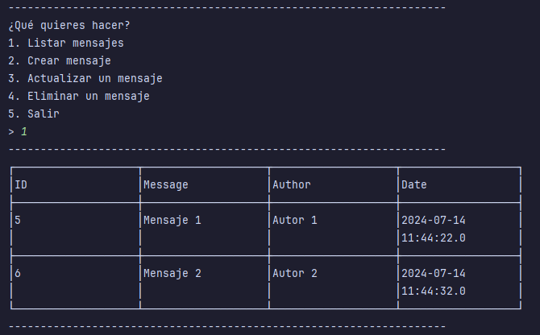

# Messages App

[](https://openjdk.org/)
[](https://maven.apache.org/)
[](https://www.mysql.com/)

Interfaz de terminal para administrar mensajes, desarrollado como proyecto del [Curso Java SE Persistencia de Datos de Platzi](https://platzi.com/cursos/java-persistencia/).



## Requisitos

- Java 21 o superior
- Apache Maven 3.6 o superior
- MySQL 8.0 o superior

## Configuración

### Base de Datos

1. Instalar MySQL y crear una base de datos para el proyecto:
    ```sql
    CREATE DATABASE messages_app;
    ```

2. Crear una tabla para almacenar los mensajes:
    ```sql
    USE messages_app;

    CREATE TABLE messages (
        id BIGINT AUTO_INCREMENT PRIMARY KEY,
        message VARCHAR(280) NOT NULL,
        message_author VARCHAR(50) NOT NULL,
        message_date TIMESTAMP DEFAULT CURRENT_TIMESTAMP
    );
    ```

3. Configurar el archivo `src/main/resources/META-INF/persistence.xml` con tus credenciales de MySQL:
    ```xml
   <?xml version="1.0" encoding="UTF-8" ?>
    <persistence xmlns="http://java.sun.com/xml/ns/persistence" version="2.0">
        <persistence-unit name="messagesAppPersistenceUnit" transaction-type="RESOURCE_LOCAL">
            <provider>org.hibernate.jpa.HibernatePersistenceProvider</provider>

            <class>com.dfortch.messagesapp.persistence.entity.Message</class>
        
            <properties>
                <property name="jakarta.persistence.jdbc.url" value="jdbc:mysql://localhost:3306/messages_app"/>
                <property name="jakarta.persistence.jdbc.user" value="mysql_user"/>
                <property name="jakarta.persistence.jdbc.password" value="mysql_password"/>
                <property name="jakarta.persistence.jdbc.driver" value="com.mysql.jdbc.Driver"/>
                <property name="jakarta.persistence.schema-generation.database.action" value="update"/>
            </properties>
        </persistence-unit>
    </persistence>
    ```

## Reconocimientos

- [ASCII Table](https://github.com/vdmeer/asciitable): Modulo para crear tablas ASCII
